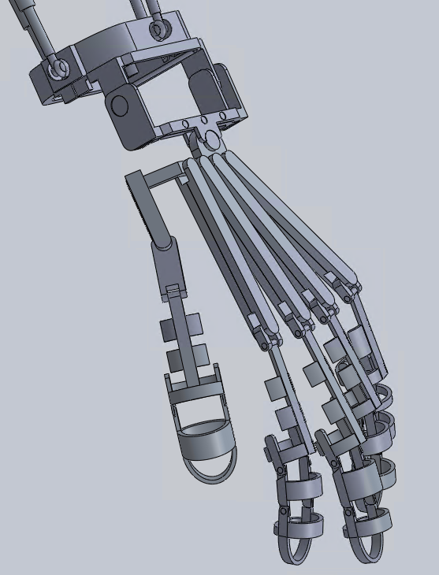
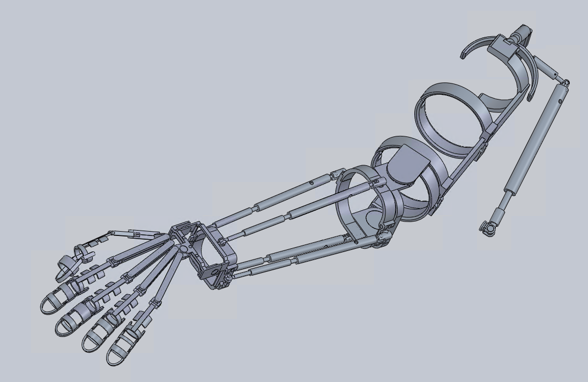

# solidworks-exoskeleton
A flexible 3D exoskeleton system for arm and legs modelled using Solidworks. The system can be wore onto arms and legs with little to none hindrance on local movements.

## Usage
Each parts and assemblies can be opened individually in Solidworks.
